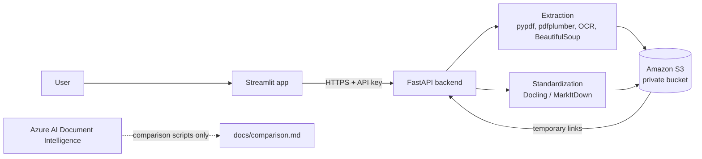

# Unstructured Data Ingestion Pipeline

Extracts text, tables, formulas, and images from PDFs and web pages, converts them
to clean Markdown with Docling and MarkItDown, stores everything in a private Amazon
S3 bucket, and exposes it through a FastAPI backend and a Streamlit web app.

## Live demo

- **Web app (Streamlit):** https://ingestion-pipeline-w2z8tszk8fb2vtw9cx7yed.streamlit.app/
- **API (FastAPI on Render):** https://ingestion-pipeline-p2jv.onrender.com  (interactive docs at `/docs`)
- **Demo video:** <<link>>
- **Comparison write-up:** [docs/comparison.md](docs/comparison.md)

> The free Render server sleeps when idle, so the first request can take about a minute.
> The hosted API offers **MarkItDown only**: the free instance does not have enough memory
> for Docling. Docling works when you run the project locally (see below) or with the
> included `Dockerfile` on a larger host.

## Architecture



**How the pieces fit**

1. **Extraction:** open-source libraries pull out text (pypdf), tables and images (pdfplumber),
   image text (Tesseract OCR), and web page content (requests + BeautifulSoup).
   Azure AI Document Intelligence processes the same documents in separate scripts for the comparison.
2. **Standardization:** Docling and MarkItDown rebuild each document as Markdown in reading order,
   with headings, tables, LaTeX formulas, and image links.
3. **Storage:** raw files, images, and Markdown go to a private, encrypted S3 bucket with
   metadata and tags.
4. **API:** FastAPI accepts a PDF upload or a URL, runs the chosen tool, stores results, and
   returns the Markdown plus links.
5. **Front end:** Streamlit lets anyone upload or paste, choose a tool, and view or download the result.

## S3 layout

```
raw/pdf/<source>/<YYYY-MM-DD>/<file>.pdf
raw/html/<source>/<YYYY-MM-DD>/<file>.html
processed/markdown/<tool>/<source>/<docid>.md
assets/images/<source>/<docid>/<tool>_<image>.png
```

`<source>` is where the document came from (`arxiv`, `uploaded`, or a website name),
`<tool>` is `docling` or `markitdown`, and `<docid>` is the first 10 characters of the
file's SHA-256 hash, so a document's Markdown and images can always be found together.
Every object has metadata (`source-url`, `tool`, `doc-type`, `processed-date`, `doc-id`)
and tags (`tool`, `doc-type`, `source`, `processed-date`). The bucket blocks all public access
and uses server-side encryption (SSE-S3). Markdown stored in S3 links to images with `s3://` addresses;
the API swaps these for temporary signed links when returning Markdown to the browser.

## API endpoints

| Method | Path | Purpose |
|---|---|---|
| GET | `/health` | Is the service running |
| GET | `/tools` | Which conversion tools this server offers |
| POST | `/extract/pdf` | Open-source extraction (text, tables, image count) |
| POST | `/extract/url` | Open-source web scraping |
| POST | `/convert/pdf` | Upload a PDF, convert with `docling` or `markitdown`, store in S3 |
| POST | `/convert/url` | Convert a web page, store in S3 |

Protected endpoints require an `x-api-key` header.

## Setup

### Prerequisites
- Python 3.11, Git
- [Tesseract OCR](https://github.com/UB-Mannheim/tesseract/wiki) (Windows installer; on Linux `apt install tesseract-ocr`)
- An AWS account with an S3 bucket and an IAM user limited to that bucket
- An Azure AI Document Intelligence resource (only for the comparison scripts)

### Install
```bash
git clone https://github.com/DurgaDevi-Subramanian/ingestion-pipeline
cd ingestion-pipeline
python -m venv .venv
# Windows: .venv\Scripts\activate     Mac/Linux: source .venv/bin/activate
pip install -r requirements.txt
```

### Configure
Copy `.env.example` to `.env` and fill in your values. **Never commit `.env`.**

### Run the extraction experiments
Put your test PDFs in `data/pdfs/` and web page URLs in `data/urls.txt`, then:
```bash
python run_task1.py data/pdfs/paper1.pdf        # open-source PDF extraction + OCR
python run_task1_azure.py data/pdfs/paper1.pdf  # Azure Document Intelligence
python run_task2.py                             # web scraping
python download_pages.py                        # save pages as HTML for Docling
python run_task4.py                             # Docling and MarkItDown on everything
python run_task5.py                             # upload outputs to S3
```

### Run the API and app locally
```bash
uvicorn app.main:app --reload                   # http://127.0.0.1:8000/docs
streamlit run frontend/streamlit_app.py         # http://localhost:8501
```

## Deployment

- **Backend (Render):** Python web service. Build command `pip install -r requirements-api.txt`,
  start command `uvicorn app.main:app --host 0.0.0.0 --port $PORT`. Set the environment variables
  from `.env.example` in Render's settings, with `ENABLE_DOCLING=0` on the small free instance.
- **Backend with Docling:** build the included `Dockerfile` on a host with 4 GB+ of RAM.
- **Front end (Streamlit Community Cloud):** main file `frontend/streamlit_app.py`; add `API_URL`
  and `API_KEY` under Secrets. `frontend/requirements.txt` keeps its install small.

## Test set

arXiv papers (not included in this repo for copyright reasons):

Web pages: 
https://en.wikipedia.org/wiki/Artificial_intelligence
https://docs.python.org/3/tutorial/introduction.html
https://en.wikipedia.org/wiki/Periodic_table

## Limitations

- Hosted API: MarkItDown only (memory limit); Docling available locally.
- Azure's free tier reads two pages per request, so documents were split into two-page pieces,
  and tables crossing those boundaries were cut.
- OCR does not preserve table structure and often garbles equations.
- Free hosts sleep when idle, so the first request after a pause is slow.

## Cost and cleanup

Built to stay under $5 using free tiers, budget alerts, and a small S3 footprint.
After use, delete the Render service, empty and delete the S3 bucket, delete the IAM access
key, and delete the Azure resource group.